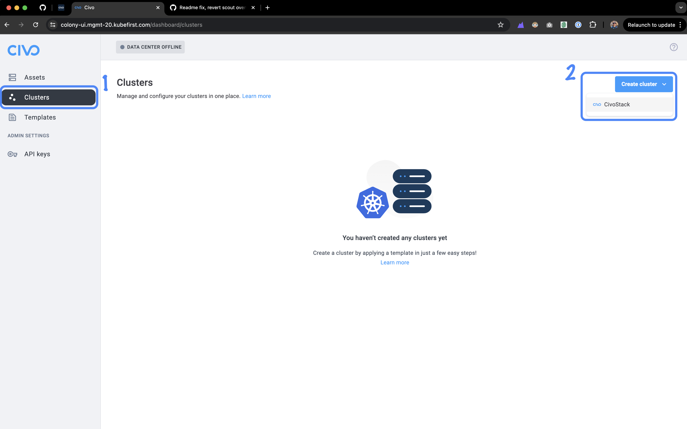
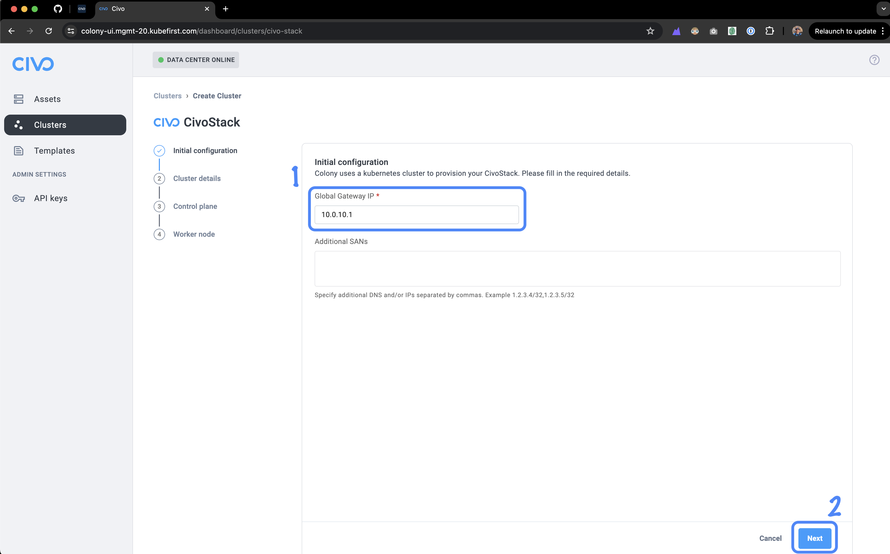
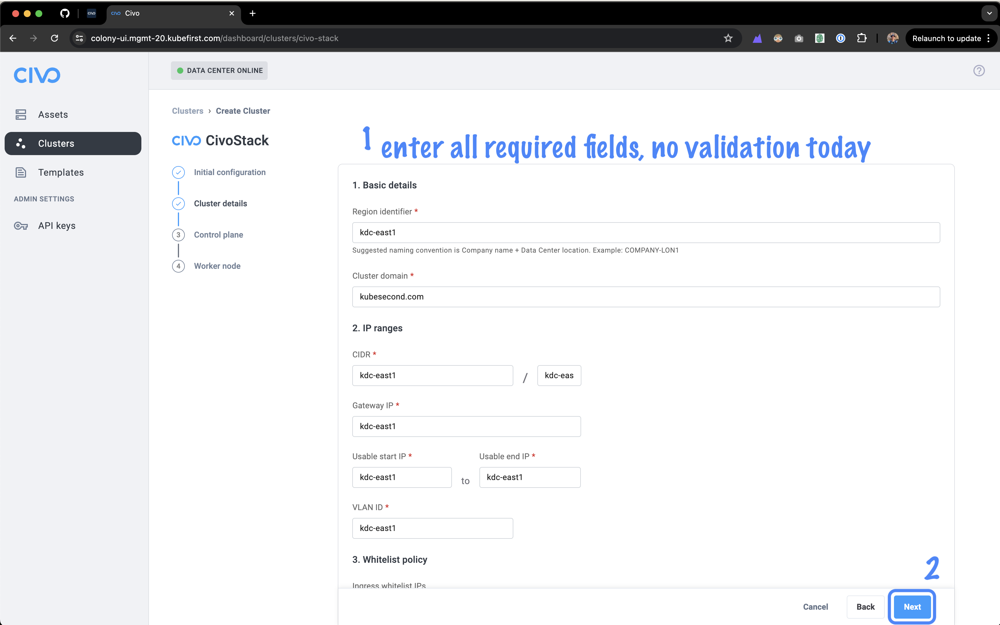
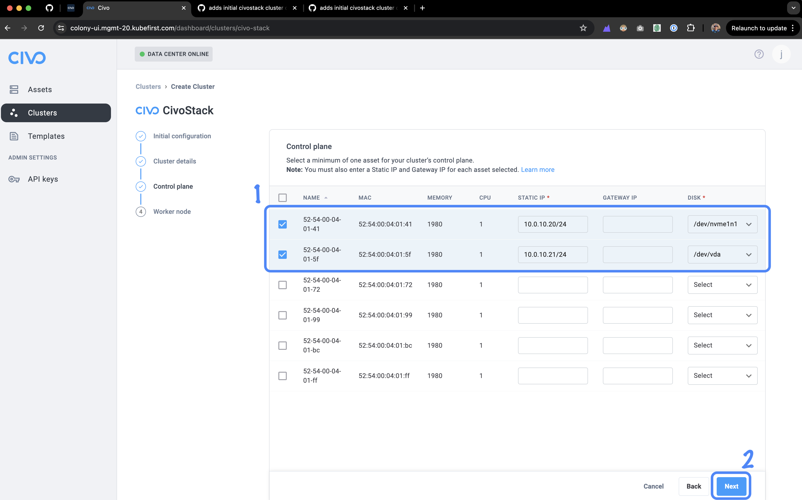
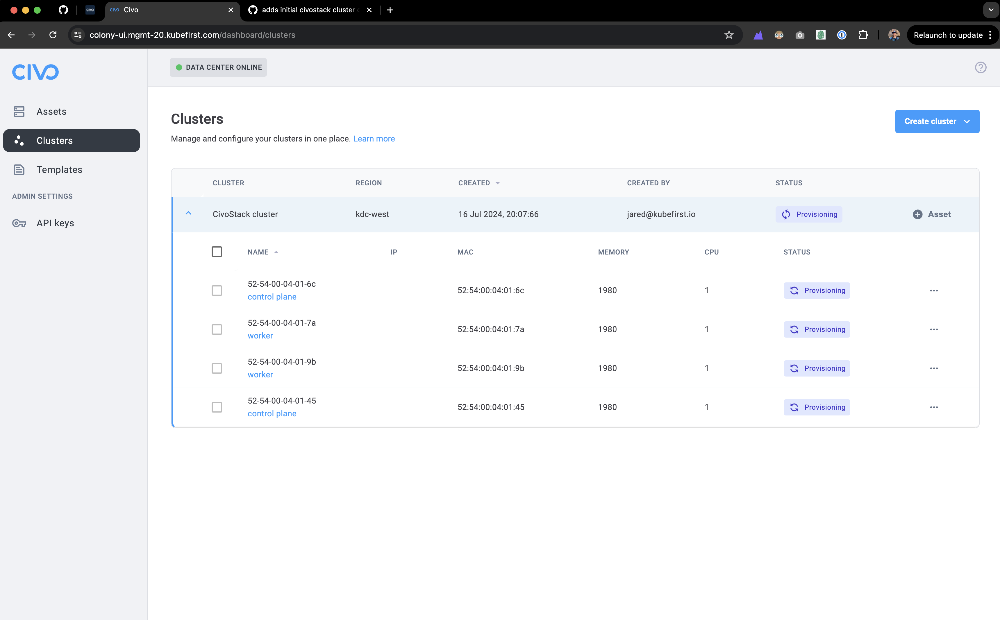
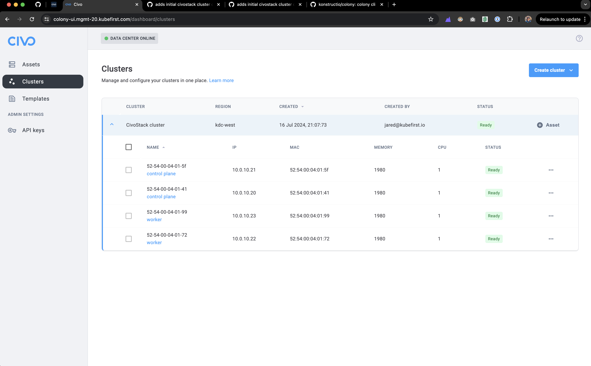

# Quickstart With Make

This allows you to reach step 8 in a single command after providing the required inputs.

## Provision your vagrant data center on a Civo compute instance

```bash
make dc
```

## select `create datacenter`

```sh
> create datacenter
```

:clock1: :coffee: You need to wait for the Civo instance to provision, install Vagrant and all dependencies, you can access to machine with `> ssh datacenter-vm` and test manually if vagrant commands are installed, you can return with `> exit` :arrow_backward:

When the process finish, you will be logged in your laptop automatically you can check the process of provisioning machines with:

```bash
echo $COLONY_API_KEY

colony init \
  --apiKey="$COLONY_API_KEY" \
  --url="https://colony-api-virtual.konstruct.io"

exit
```

## power on six machines from the data center instance

```sh
bash virtual-datacenter/power-on.sh

exit

vagrant ssh laptop
kubectl get workflows
```

## Create a CivoStack Enterprise cluster

Visit the "Clusters" tab in the left gutter and click the "Create Cluster" button.



## Initial Configuration

For the Global Gateway IP enter `10.0.10.1`, optionally add SAN's to specify additional DNS names or IP addresses that should be protected by the certificate generated for Kubernetes.



## CivoStack Enterprise Cluster Details

The cluster details today do not have validation but will be passed through to the configmap in the default namespace as the super cluster configuration.



## Control Plane Selection

For the control planes, select two available hardware. Enter `10.0.10.20/24` for the first control plane static IP address and select a disk. For the second control plane enter `10.0.10.21/24` for the static IP address and select a disk.

*note:* we do not need a value for Gateway IP



## Worker Node Selection

For the worker nodes, select two available hardware. Enter `10.0.10.22/24` for the first selected worker node as the static IP address, leave the Gateway IP empty, and select a disk. For the second worker node enter `10.0.10.23/24` for the second selected worker node as the static IP address, leave the Gateway IP empty, select a disk, and hit the "Create Cluster" button to create the super cluster.


## Cluster Create in Progress

the cluster will take around 10 minutes to fully provision, grab a cup of coffee and come back in a few



## Cluster Create Complete

cluster creation complete!



```sh
bash virtual-datacenter/destroy.sh

vagrant ssh laptop

kubectl -n tink-system delete hw,wf --all

todo: delete all records from database
```

Notes to iterate demo from this point:

- vagrant destroy machine1
- vagrant ssh laptop
- k delete wf --all
- k delete hw --all
- exit back to datacenter
- connect to cockroach from local
- delete workflows and hardwares where account_id=xxx
- check ui, assets are empty
- return to step 10 when demoing
